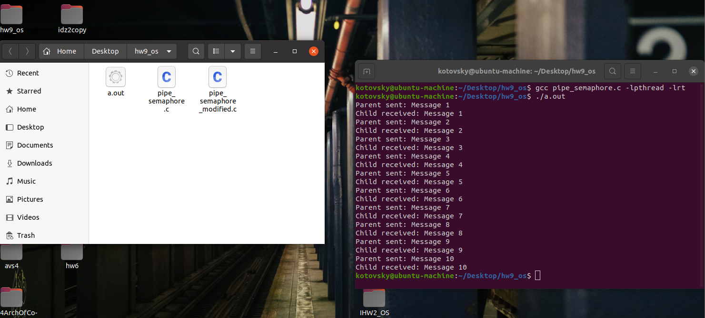

# Домашнее задание №9. Операционные системы
### Выполнил Котовский Семён Олегович, БПИ-219.

### Отчет о работе программы
### Задача

1. Реализовать для родительского и дочернего процесса двухстороннюю связь с использованием только одного неименованного канала (pipe) и циклической организацией обмена посредством семафора. При этом канал должен быть постоянно открытым. Обмен должен завершаться после поочередной передачи в каждую сторону по десять сообщений. По завершении обмена обеспечить корректное закрытие каналов и удаление семафора. 
2. Опционально Вместо десяти обменов организовать поочередный обмен, завершающийся посылкой сигнала прерывания с клавиатуры родительскому или дочернему процессу. При этом оба процесса должны корректно завершить работу с закрытием канала и удалением семафора.

### Описание программы:

Программа реализует двухстороннюю связь между родительским и дочерним процессами с использованием одного неименованного канала и семафоров. Канал должен быть постоянно открытым. Обмен должен заканчиваться после поочередной передачи в каждую сторону по десять сообщений. По завершении обмена программа должна закрыть каналы и удалить семафоры.

Программа создает неименованный канал с помощью системного вызова pipe. Затем создаются два семафора: sem_parent и sem_child. Семафор sem_parent инициализируется значением 1, а sem_child - значением 0. Затем процесс порождает дочерний процесс с помощью системного вызова fork.

В дочернем процессе вызывается функция close для закрытия дескриптора записи pipe_fd[1]. Затем процесс входит в цикл, в котором происходит прием сообщений от родительского процесса через канал. Для синхронизации работы процессов используется семафор sem_child. Дочерний процесс ждет, пока родительский процесс увеличит значение sem_child. После этого происходит чтение из канала с помощью системного вызова read, и полученное сообщение выводится на экран. Затем дочерний процесс увеличивает значение sem_parent, чтобы разрешить продолжение работы родительского процесса.

В родительском процессе вызывается функция close для закрытия дескриптора чтения pipe_fd[0]. Затем процесс входит в цикл, в котором происходит отправка сообщений в дочерний процесс через канал. Для синхронизации работы процессов используется семафор sem_parent. Родительский процесс ждет, пока дочерний процесс увеличит значение sem_parent. После этого происходит запись в канал с помощью системного вызова write. Затем родительский процесс увеличивает значение sem_child, чтобы разрешить продолжение работы дочернего процесса.

После того как процессы обменяются по 10 сообщений в каждую сторону, родительский процесс закрывает дескриптор записи и ждет завершения дочернего процесса с помощью системного вызова wait. После этого закрываются дескрипторы и удаляются семафоры с помощью системных вызовов close, sem_close и sem_unlink.

### Запуск программы

Программа может быть скомпилирована с помощью компилятора GCC следующей командой:
```
gcc -o program program.c -lrt
```

После этого программа может быть запущена в терминале следующей командой:

```
./program
```

### Модификация кода на доп. оценку:

Была добавлена обработка сигнала SIGINT с помощью функции-обработчика sigint_handler. Функция устанавливается с помощью системного вызова signal. Также был добавлен цикл в каждый из процессов, который выполняется до тех пор, пока не будет получен сигнал SIGINT. Переменная stop имеет тип sig_atomic_t, что гарантирует корректность работы с ней внутри обработчика сигнала.

Добавление обработки сигнала SIGINT позволяет корректно завершать программу по команде пользователя (например, при нажатии на клавишу Ctrl+C в терминале). Без этого обработчика программа не завершится корректно при получении сигнала SIGINT и может оставить нежелательные процессы в системе.

### Пример работы программы:

